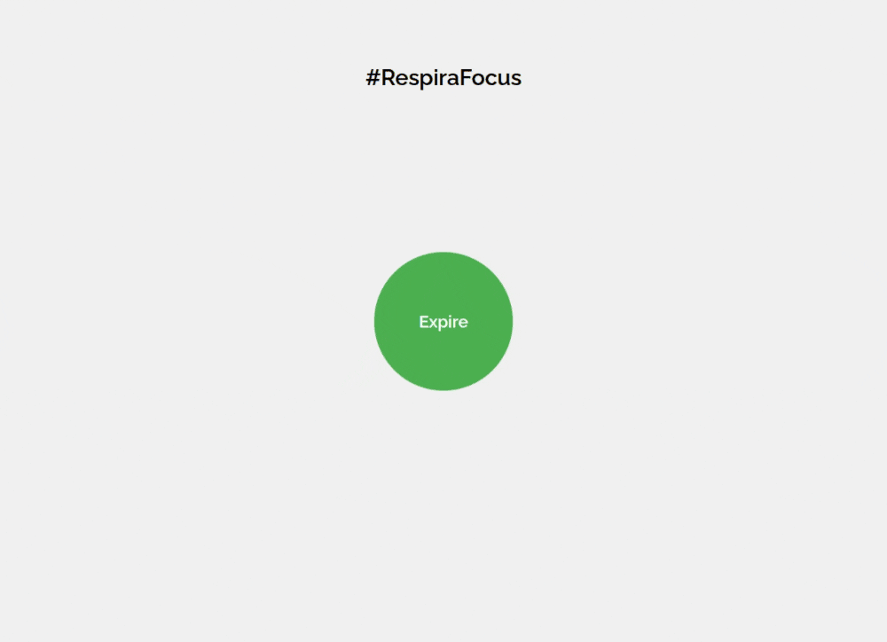

# 4-4-6 Breathing Technique Visualizer

This is a simple web application that visually represents the 4-4-6 breathing technique using an animated circle. The circle expands and contracts to guide the user through the phases of inhaling, holding, and exhaling, helping to practice mindful and relaxing breathing.

## What is the 4-4-6 breathing technique?

The 4-4-6 technique involves:

- Inhaling through the nose for 4 seconds
- Holding the breath for 4 seconds
- Exhaling slowly through the mouth for 6 seconds

This practice can help reduce anxiety, improve focus, and promote relaxation.

## How does the project work?

- The circle grows during the inhale phase (4 seconds)
- The circle stays the same size during the hold phase (4 seconds)
- The circle shrinks during the exhale phase (6 seconds)
- The cycle repeats continuously

## Technologies used

- HTML5
- CSS3 (for animations)
- JavaScript (to control timing and animation states)

## How to use

1. Clone or download this repository.
2. Open the `index.html` file in a modern web browser.
3. Watch the animated circle and follow its rhythm to practice the breathing technique.

## Example usage

